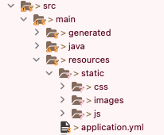

# Jsp 사용하기(Gradle)

**기록 ✍️**

#### author : jung yuha

#### **first Registered :** 2022-10-28 Fri

#### last modified : 2022-10-28 Fri

## \[1] Jsp 설정하기

### (1) build.gradle에 의존성 추가

1. 다음과 같이 의존성을 추가
2. 프로젝트 우클릭 - Gradle -  Refresh Gradle Project 를 실행한다.

#### build.gradle

```properties
dependencies {    
    implementation('javax.servlet:jstl')
    implementation('org.apache.tomcat.embed:tomcat-embed-jasper')
}
```

### (2) VIEW 경로 지정

#### application.yml

<pre class="language-properties"><code class="lang-properties"><strong>spring:  
</strong>  mvc:
    view:
      prefix: /WEB-INF/views/
      suffix: .jsp
    static-path-pattern : /resources/static/**</code></pre>

### (3) VIEW 디렉토리 추가

* src/main 밑에 webapp 디렉토리가 default 경로가 된다. 따라서 아래와 같이 디렉토리를 만든다.
* .png>)

### (4) static 파일 디렉토리 추가

#### 1. 디렉터리 만들기

application.yml에서  static 경로를 지정해주었으므로 다음과 같이 디렉토리를 만든다.



#### application.yml

<pre class="language-properties"><code class="lang-properties"><strong>spring:  
</strong>  mvc:
    view:
      prefix: /WEB-INF/views/
      suffix: .jsp
    static-path-pattern : /resources/static/**</code></pre>

#### 2. static 파일 선언하기

JSP에는 다음과 같은 형태로 static 파일 경로를 지정해준다.

#### test1.jsp

<figure><figcaption></figcaption></figure>

## \[2] 컨트롤러 만들기

### (1) 컨트롤러 생성

#### 1. @Controller 어노테이션을 선언한다.

#### 2. @RequestMapping을 통해 맵핑 경로를 선언한다.

```java
@GetMapping("/test")
```

#### 3. 전송할 데이터를 담는다.

화면에 띄울 데이터가 있는 경우 Model 타입을 선언하여 원하는 데이터를 담는다.

```java
 List<Post> list = new ArrayList<>();
 model.addAttribute("list", list);
```

#### 4. JSP를 리턴한다.

보여줄 JSP 파일명을 리턴한다.

```java
return "test1";
```

### (2) 코드

```java
@Controller
public class testController {
	@RequestMapping("/test")
    public String test(Model model) {
		List<String> list = new ArrayList<>();
		
        list.add("11");
        list.add("22");
        
        model.addAttribute("list", list);
        
        return "test1";
    }
}
```
